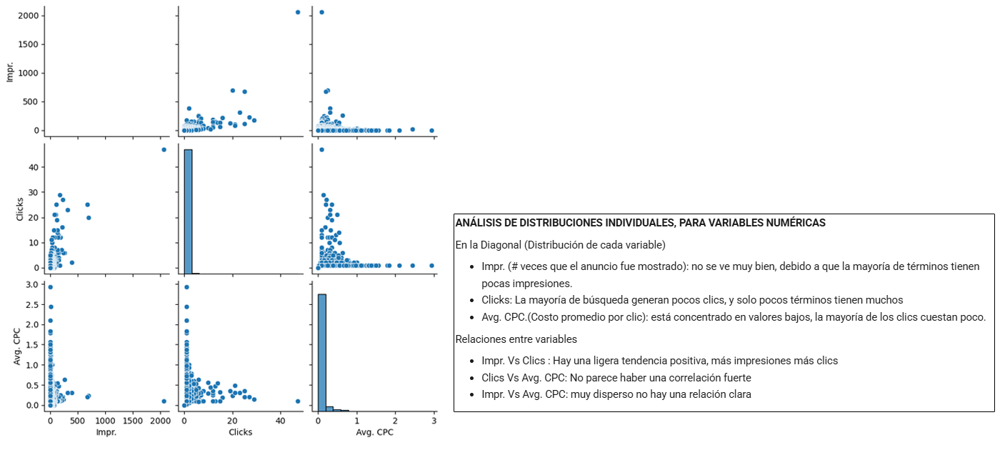
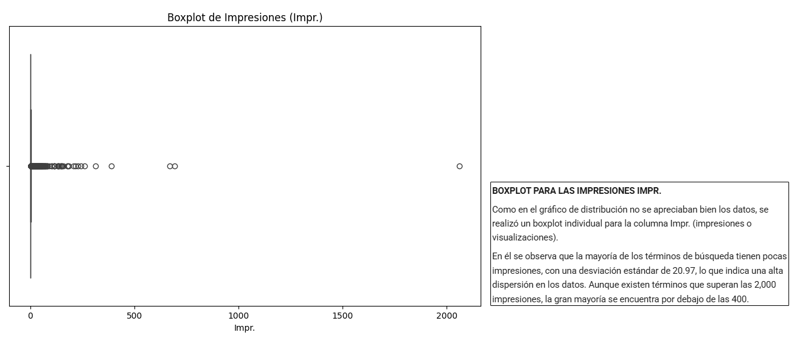
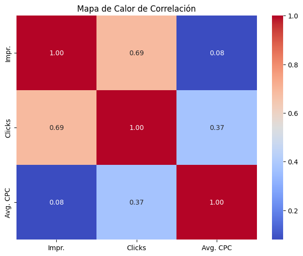
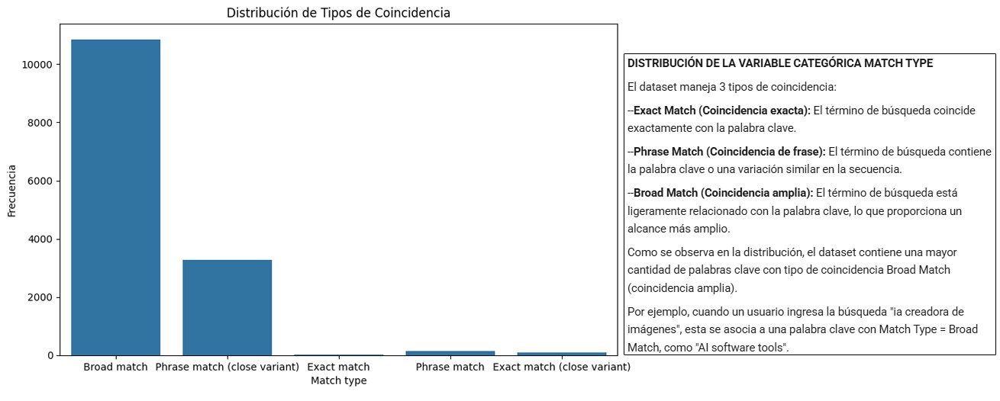

# Aprendizaje No Supervisado 
## 📑 Índice
1. [📂 Descripción y Estructura del Proyecto](#1---descripción-y-estructura-del-proyecto)
2. [💻 Entorno de Trabajo](#2---entorno-de-trabajo)
3. [🔍 Análisis Exploratorio de Datos (EDA)](#3---análisis-exploratorio-de-datos-eda)
4. [⚙️ Preprocesamiento](#4--️-preprocesamiento)


## 1.- 📂 Descripción del proyecto
El equipo de Marketing está preparando una campaña publicitaria para productos relacionados con la inteligencia artificial y nos ha solicitado que les proporcionemos palabras clave que optimicen sus búsquedas en Google.

Para esto hemos utilizado el dataset: https://www.kaggle.com/datasets/devraai/ai-google-search-keyword-performance

Este dataset nos proporciona información sobre el rendimiento de palabras clave relacionadas con la inteligencia artificial en las búsquedas de Google. Este dataset es útil para analizar tendencias de búsqueda y evaluar la popularidad de términos específicos en el ámbito de la IA.

### Objetivo General
Agrupar términos de búsqueda (Search terms) en clusters según su rendimiento publicitario, para ayudar al equipo de marketing a:
- Detectar segmenos de alto rendimiento
- Identificar términos costosos
- Optimizar la asignación de presupuesto

## 2.- 💻 Entorno de Trabajo
Nombrar herramientas y librerías.

## 3.- 🔍 Análisis Exploratorio de Datos (EDA) 
El dataset contiene las siguientes variable o columnas

| Nombre de columna | Tipo de dato | Tipo de variable            | Descripción breve                                                           | Utilidad principal en el análisis                                        |
|-------------------|--------------|-----------------------------|-----------------------------------------------------------------------------|--------------------------------------------------------------------------|
| Search term       | Texto        | Categórica nominal          | Consulta real ingresada por el usuario en Google.                           | Detectar intención del usuario, descubrir nuevas palabras clave valiosas.|
| Match type        | Texto        | Categórica ordinal          | Tipo de coincidencia entre el search term y keyword (Exact, Phrase, Broad). | Evaluar el grado de control sobre la intención del usuario y refinar segmentación.|
| Impr.             | Numérico     | Cuantitativa discreta       | Número de veces que el anuncio fue mostrado.                                | Mide visibilidad, sirve para calcular CTR y evaluar alcance.             |
| Clicks            | Numérico     | Cuantitativa discreta       | Veces que el anuncio fue clicado.                                           | Mide interés y engagement del usuario, insumo para calcular CTR.         |
| Currency code     | Texto        | Categórica nominal          | Código de la moneda usada en los reportes (e.g., USD, EUR).                 | No sirve para nuestro análisis, se excluirá                              |
| Avg. CPC          | Numérico     | Cuantitativa continua       | Costo promedio por clic generado por el término de búsqueda.                | Mide eficiencia de inversión publicitaria.                               |
| Keyword           | Texto        | Categórica nominal          | Palabra clave objetivo que activó el anuncio.                               | Permite analizar relación entre keyword y término de búsqueda, y optimizar campañas. |


### 🟦 Análisis de distribuciones individuales


### 🟦 Boxplot y Matriz de Correlación

<p align="center">

</p>

### 🟦 Distribución de la variable no categórica Match Type


### Después de realizar el análisis individual de cada variable, se obtuvieron las siguientes conclusiones:

**1. Alta concentración de datos en valores bajos**
*   La mayoría de los términos tienen bajo impacto (pocas impresiones, clics y bajo CPC)
  
**2. Pocos términos dominan la distribución**
*   Probablemente, unas pocas palabras clave son muy efectivas

**2. Tendencia general (Impr. vs Clicks)**
*   Las dos variables presentan una correlación positiva, esto se respalda por la matriz de correlación, en la que se reporta un coeficiente de 0.69.

**3. Se puede calcular valores adicionales como:**
*   **Tasa de Clics o CTR (Click-Through Rate)** =  (Clics / Impr.)
*   Un CTR alto → el anuncio o enlace es relevante y atractivo para los usuarios.
*   Un CTR bajo → podría indicar que el contenido no está llamando la atención o no está bien dirigido al público adecuado.
*   **Costo Total** =  Clicks * Avg. CPC , Aunque no resulta útil para nuestro análisis, es un valor que puede calcularse.

## 4.- [⚙️ Preprocesamiento](#3--️-preprocesamiento)

Para la Limpieza y Preprocesamiento de datos se realizó lo siguiente:

- Se eliminó la columna Currency code del DATASET_NAMES

- Se eliminó Duplicados si existieran

- Se eliminan filas con valores nulos en las columnas importantes

- Se agregó la Columna CTR (Tasa de Clics) = Clicks/ Impr.

Esto dió como resultado un nuevo dataset preprocesado que se encuentra en: <a href="https://github.com/ancantos99/g6_aprendizajeautomaticoico_s3/tree/main/dataset/dataset_procesado.csv" target="_blank">dataset/dataset_procesado.csv</a>

Para terminar el preprocesamiento con el nuevo dataset realizo la normalización de los datos para las variables cuantitativas

```python
columnas = ['Impr.', 'Clicks', 'Avg. CPC', 'CTR']
scaler = StandardScaler()
X_scaled = scaler.fit_transform(df[columnas])
```

