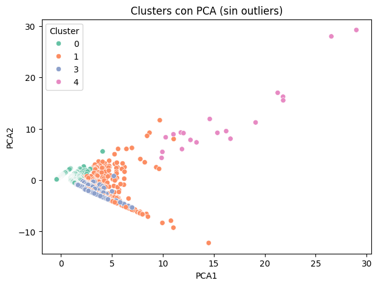
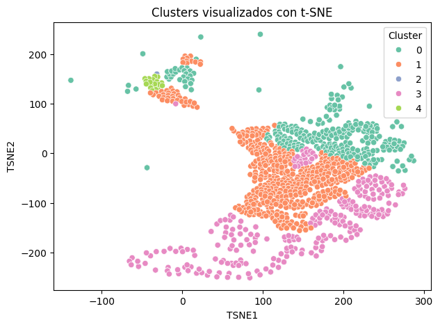

# Aprendizaje No Supervisado 
## 📑 Índice
1. [📂 Descripción y Estructura del Proyecto](#1---descripción-y-estructura-del-proyecto)
2. [💻 Entorno de Trabajo](#2---entorno-de-trabajo-y-librerías-utilizadas)
3. [🔍 Análisis Exploratorio de Datos (EDA)](#3---análisis-exploratorio-de-datos-eda)
4. [⚙️ Preprocesamiento](#4--️-preprocesamiento)
5. [🤖 Implementación de Modelos](#5---implementación-de-modelos)
   1. [🛠️ Implementación de K means](#51--️-implementación-de-k-means)
   2. [🛠️ Implementación de DBSCAN](#52--️-implementación-de-dbscan)
6. []

## 1.- 📂 Descripción del proyecto
El equipo de Marketing está preparando una campaña publicitaria para productos relacionados con la inteligencia artificial y nos ha solicitado que les proporcionemos palabras clave que optimicen sus búsquedas en Google.

Para esto hemos utilizado el dataset: https://www.kaggle.com/datasets/devraai/ai-google-search-keyword-performance

Este dataset nos proporciona información sobre el rendimiento de palabras clave relacionadas con la inteligencia artificial en las búsquedas de Google. Este dataset es útil para analizar tendencias de búsqueda y evaluar la popularidad de términos específicos en el ámbito de la IA.

#### Objetivo General
Agrupar términos de búsqueda (Search terms) en clústers según su rendimiento publicitario, para ayudar al equipo de marketing a:
- Detectar segmenos de alto rendimiento
- Identificar términos costosos
- Optimizar la asignación de presupuesto

## 2.- 💻 Entorno de Trabajo y librerías utilizadas

Este proyecto fue desarrollado con Python en Google Colab

**Librerías utilizadas**

- **pandas**: para la carga, exploración y manipulación estructurada de los datos.
- **numpy**: soporte para operaciones matemáticas y manejo eficiente de arreglos numéricos.
- **matplotlib.pyplot** y **seaborn**: utilizadas para la visualización de datos mediante gráficos como histogramas, diagramas de dispersión y mapas de calor.
- **scikit-learn (sklearn)**: para el preprocesamiento de datos, reducción de dimensionalidad y aplicación de algoritmos de aprendizaje no supervisado:
  - `StandardScaler`: normaliza los datos para que todas las variables tengan igual importancia en los cálculos de distancia.
  - `KMeans` y `DBSCAN`: algoritmos de *clustering* utilizados para identificar patrones o grupos similares en el dataset.
  - `PCA (Principal Component Analysis)` y `t-SNE (t-distributed Stochastic Neighbor Embedding)`: técnicas de reducción de dimensionalidad empleadas para visualizar los datos y los resultados del clustering en dos dimensiones.

## 3.- 🔍 Análisis Exploratorio de Datos (EDA) 
El dataset contiene las siguientes variable o columnas

| Nombre de columna | Tipo de dato | Tipo de variable            | Descripción breve                                                           | Utilidad principal en el análisis                                        |
|-------------------|--------------|-----------------------------|-----------------------------------------------------------------------------|--------------------------------------------------------------------------|
| Search term       | Texto        | Categórica nominal          | Consulta real ingresada por el usuario en Google.                           | Detectar intención del usuario, descubrir nuevas palabras clave valiosas.|
| Match type        | Texto        | Categórica ordinal          | Tipo de coincidencia entre el search term y keyword (Exact, Phrase, Broad). | Evaluar el grado de control sobre la intención del usuario y refinar segmentación.|
| Impr.             | Numérico     | Cuantitativa discreta       | Número de veces que el anuncio fue mostrado.                                | Mide visibilidad, sirve para calcular CTR y evaluar alcance.             |
| Clicks            | Numérico     | Cuantitativa discreta       | Veces que el anuncio fue clicado.                                           | Mide interés y engagement del usuario, insumo para calcular CTR.         |
| Currency code     | Texto        | Categórica nominal          | Código de la moneda usada en los reportes (e.g., USD, EUR).                 | No sirve para nuestro análisis, se excluirá                              |
| Avg. CPC          | Numérico     | Cuantitativa continua       | Costo promedio por clic generado por el término de búsqueda.                | Mide eficiencia de inversión publicitaria.                               |
| Keyword           | Texto        | Categórica nominal          | Palabra clave objetivo que activó el anuncio.                               | Permite analizar relación entre keyword y término de búsqueda, y optimizar campañas. |

Todo lo realizado en esta sección se encuentra en el archivo: <a href="https://github.com/ancantos99/g6_aprendizajeautomaticoico_s3/blob/main/colab/g6_aprendizajeautomaticoico_s3_exploraciondatos.ipynb" target="_blank">colab/g6_aprendizajeautomaticoico_s3_exploraciondatos.ipynb</a>

#### 🟦 Análisis de distribuciones individuales


#### 🟦 Boxplot y Matriz de Correlación

<p align="center">

</p>

#### 🟦 Distribución de la variable no categórica Match Type


### Después de realizar el análisis individual de cada variable, se obtuvieron las siguientes conclusiones:

**1. Alta concentración de datos en valores bajos**
*   La mayoría de los términos tienen bajo impacto (pocas impresiones, clics y bajo CPC)
  
**2. Pocos términos dominan la distribución**
*   Probablemente, unas pocas palabras clave son muy efectivas

**2. Tendencia general (Impr. vs Clicks)**
*   Las dos variables presentan una correlación positiva, esto se respalda por la matriz de correlación, en la que se reporta un coeficiente de 0.69.

**3. Se puede calcular valores adicionales como:**
*   **Tasa de Clics o CTR (Click-Through Rate)** =  (Clics / Impr.)
*   Un CTR alto → el anuncio o enlace es relevante y atractivo para los usuarios.
*   Un CTR bajo → podría indicar que el contenido no está llamando la atención o no está bien dirigido al público adecuado.
*   **Costo Total** =  Clicks * Avg. CPC , Aunque no resulta útil para nuestro análisis, es un valor que puede calcularse.

  
## 4.- ⚙️ Preprocesamiento


Para la Limpieza y Preprocesamiento de datos se realizó lo siguiente:

- Se eliminó la columna Currency code del DATASET_NAMES

- Se eliminó Duplicados si existieran

- Se eliminan filas con valores nulos en las columnas importantes

- Se agregó la Columna CTR (Tasa de Clics) = Clicks/ Impr.

- Renombrar Nombre de Columnas para mejor comprensión: Search term -> TerminoBusqueda, Impr. -> Impresiones, CTR -> TasaClicks, Avg. CPC->CostoxClick

Esto dió como resultado un nuevo dataset preprocesado que se encuentra en: <a href="https://github.com/ancantos99/g6_aprendizajeautomaticoico_s3/tree/main/dataset/dataset_procesado.csv" target="_blank">dataset/dataset_procesado.csv</a>

Para terminar el preprocesamiento, con el nuevo dataset se realizo la normalización de los datos para las variables cuantitativas.

Este paso es fundamental, ya que observamos que la distribución de las variables es muy dispersa. Por ejemplo, la variable Impr. presenta una desviación estándar de 20.9, lo que indica una alta variabilidad.

```python
columnas = ['Impr.', 'Clicks', 'Avg. CPC', 'CTR']
scaler = StandardScaler()
X_scaled = scaler.fit_transform(df[columnas])
```
Con esto, los datos quedarán preparados para ser utilizados en los modelos de clustering K-Means y DBSCAN.


## 5.- 🤖 Implementación de Modelos

Se aplicarán los modelos sobre los términos de búsqueda y no sobre los keywords, El objetivo es agrupar los términos según su comportamiento en Clicks, Impresiones, Tasa de Clicks y Costo promedio por Click

**¿Por qué analizamos los Términos de Búsqueda?**

En el dataset, los términos de búsqueda muestran cómo los usuarios piensan o formulan sus necesidades relacionadas con IA en los buscadores, mientras que las Keywords son palabras seleccionadas para activar el anuncio.

Al fijarnos en los Términos de búsqueda en lugar de los keywords podemos encontrar nuevos términos que sean más precisos y reales, por ejemplo:

> **Ejemplo:**  
> Una keyword configurada podría ser `inteligencia artificial`,  
> pero el término de búsqueda real podría ser `cómo usar inteligencia artificial en el aula`.

### 5.1.- 🛠️ Implementación de K means

Todo lo realizado en esta sección se encuentra en el archivo: <a href="https://github.com/ancantos99/g6_aprendizajeautomaticoico_s3/blob/main/colab/g6_aprendizajeautomaticoico_s3_KMEANS.ipynb" target="_blank">colab/g6_aprendizajeautomaticoico_s3_KMEANS.ipynb</a>

#### Elección de K

<p align="center">

</p>
Aunque el método del codo sugiere que k=4 es una buena opción, al entrenar el modelo con k=5 se obtuvo una segmentación más detallada. 

En ambos casos aparece un clúster con un solo elemento (posible outlier), pero con k=5 los demás clústers están mejor definidos, por esta razón se decidió entrenar el modelo con K = 5 obteniendo los siguiente resultados:

#### Resultados Promedios por Clúster (K=5)

| Clúster | Impresiones | Clicks  | CostoxClick | TasaClicks |  Cantidad de elementos |
|---------|-------------|---------|-------------|------------|------------------------|
| 0       | 1.92        | 0.03    | 0.0027      | 0.0039     |        13084           |
| 1       | 13.87       | 1.80    | **0.4804**  | 0.3669     |         535            |
| 2       | 2060.00     | 47.00   | 0.1000      | 0.0228     |          1             |
| 3       | 1.31        | 1.09    | 0.2238      | **0.9132** |         763            |
| 4       | **200.11**  |**18.11**| 0.2795      | 0.1321     |          19            |

**Interpretación**

- **CLÚSTER 0:** Tiene muy pocas impresiones, casi sin clicks y baja tasa de clicks este contiene la mayor cantidad de palabras (PALABRAS O FRASES IRRELEVANTES)
- **CLÚSTER 1:** Tiemen mayor costo promedio por click (PALABRAS MÁS CARAS PERO CON UNA TASA DE CLICKS ACEPTABLE)
- **CLÚSTER 2:** Tiene más impresiones y Clicks, pero solo contiene un elemento por eso lo descarto.
- **CLÚSTER 3:** Tiente más tasa de clicks promedio 91% (CONTIENE PALABRAS O FRASES QUE GENERAN ALTA EFICIENCIA)
- **CLÚSTER 4:** Descartando al 2, este es el que tiene más impresiones y Clicks (CONTIENE PALABRAS O FRASES QUE GENERAN ALTA VISIBILIDAD)


#### Visualización en 2D de los Clúster usando PCA

Con el fin de mejorar la visualización del gráfico, se excluyó el Clúster 2, ya que representa un outlier que afecta la escala

<p align="center">

</p>

#### Visualización en 2D de los Clúster usando t-SNE

Se utilizó perplexity=30 y learning_rate=200

<p align="center">

</p>

**Interpretación de ambas visualizaciones**

- PCA muestra el Clúster 4 (Rosado en PCA) relativamente aislado en la parte superior lo que sugiere que tiene características bastantes distintas al resto de datos
- A primera vista se observa que t-SNE logra “estirar” y separar los datos en el plano 2D de una forma que facilita la interpretación visual.
- En ambos gráficos, pero mucho más en el t-SNE se observa una separación clara de los clústeres, en el gráfico PCA los clústers 0,1,3 se superponen un poco
- en nuestro caso es más útil el gráfico t-SNE para realizar un análisis
  - El CLÚSTER 0 (palabras irrelevantes) se encuentra en varias áreas dispersas, lo que podría indicar que en este grupo algunas palabras no son útiles pero otras si.
  - El CLÚSTER 1 (palabras caras con tasa de clicks aceptable) parece formar un grupo más definido, aunque con cierta dispersión, pero esta dispersión sigue compacta, lo que podría reflejar la variabilidad en el costo y la tasa de clics dentro de este grupo.
  - El CLÚSTER 3 (alta eficiencia) se visualiza como un grupo relativamente compacto, lo que sugiere que las palabras clave con alta tasa de clics tienden a compartir características similares.
  - El CLÚSTER 4 (alta visibilidad) también forma un grupo compacto, aunque menos extenso que el clúster 3, lo que podría indicar una menor variedad de palabras que generan muchas impresiones y clics.

#### TOP 3 DE LOS MEJORES TÉRMINOS DE CADA CLÚSTER ORDENADOS POR TASA DE CLICKS 

**Cluster 0 (PALABRAS O FRASES IRRELEVANTES):**

| TerminoBusqueda                  | Impresiones | Clicks | CostoxClick | TasaClicks |
|----------------------------------|-------------|--------|-------------|------------|
| https www decohere ai            | 6           | 2      | 0.1         | 0.333333   |
| ai game generator                | 7           | 2      | 0.1         | 0.285714   |
| yapay zeka görsel oluşturma      | 7           | 2      | 0.1         | 0.285714   |

**Cluster 1 (PALABRAS MÁS CARAS PERO CON UNA TASA DE CLICKS ACEPTABLE):**

| TerminoBusqueda                                              | Impresiones | Clicks | CostoxClick | TasaClicks |
|--------------------------------------------------------------|-------------|--------|-------------|------------|
| ia que cria imagens de graça                                 | 7           | 5      | 0.38        | 0.714286   |
| app de inteligência artificial gratuito                      | 5           | 3      | 0.39        | 0.600000   |
| openai's musenet                                             | 7           | 4      | 0.53        | 0.571429   |

**Cluster 2 (OUTLIER):**

| TerminoBusqueda | Impresiones | Clicks | CostoxClick | TasaClicks |
|-----------------|-------------|--------|-------------|------------|
| copilot         | 2060        | 47     | 0.1         | 0.022816   |

**Cluster 3 (CONTIENE PALABRAS O FRASES QUE GENERAN ALTA EFICIENCIA)**

| TerminoBusqueda                                | Impresiones | Clicks | CostoxClick | TasaClicks |
|------------------------------------------------|-------------|--------|-------------|------------|
| doctrina ai exam                               | 9           | 6      | 0.09        | 0.666667   |
| ia para apresentação de slides                 | 5           | 3      | 0.25        | 0.600000   |
| ai project maker                               | 5           | 3      | 0.10        | 0.600000   |

**Cluster 4 (CONTIENE PALABRAS O FRASES QUE GENERAN ALTA VISIBILIDAD)**

| TerminoBusqueda                          | Impresiones | Clicks | CostoxClick | TasaClicks |
|-----------------------------------------|-------------|--------|-------------|------------|
| ia para programação                     | 80          | 21     | 0.49        | 0.262500   |
| inteligencia artificial gratis          | 50          | 12     | 0.35        | 0.240000   |
| ia para criar slides gratuito           | 65          | 15     | 0.32        | 0.230769   |

  
### 5.2.- 🛠️ Implementación de DBSCAN

